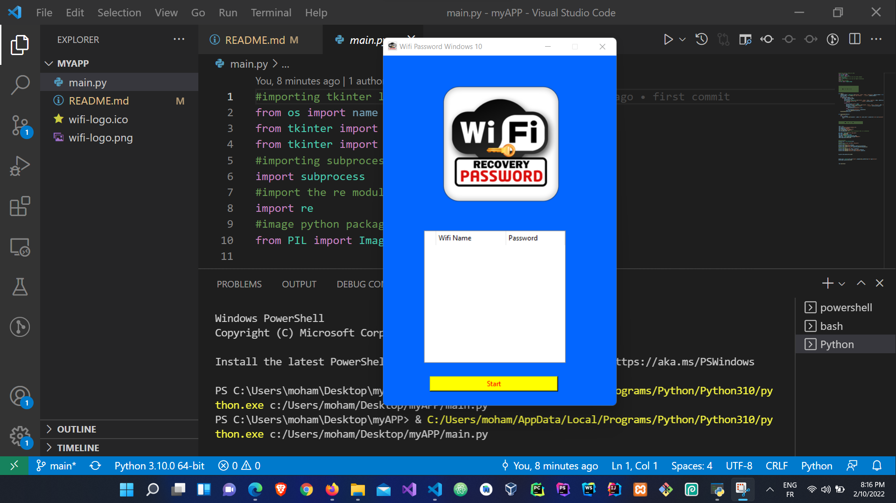
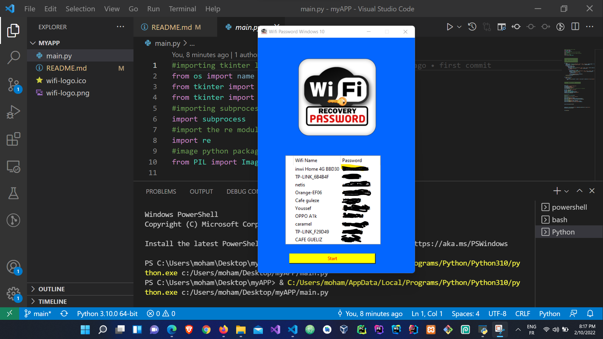

# Password Recovery App
While using my computer, I use my app to quickly show a wifi password without looking into the settings 

## The idea
As I set up my computer and it had been a while since I'd coded with Python, I felt bored, so I decided to create a program that quickly displays all of my wifi passwords without having to go to settings. All I have to do is run the program, and the passwords appear without having to go to any settings.

## How it works 
I open the app and it shows a clear table with a button that says Start. When you click Start, the app runs a command in the backend to display all available WiFi networks on your computer.

### When you run the app for the first time, it looks like this
 

### When the Start Button is clicked
 
